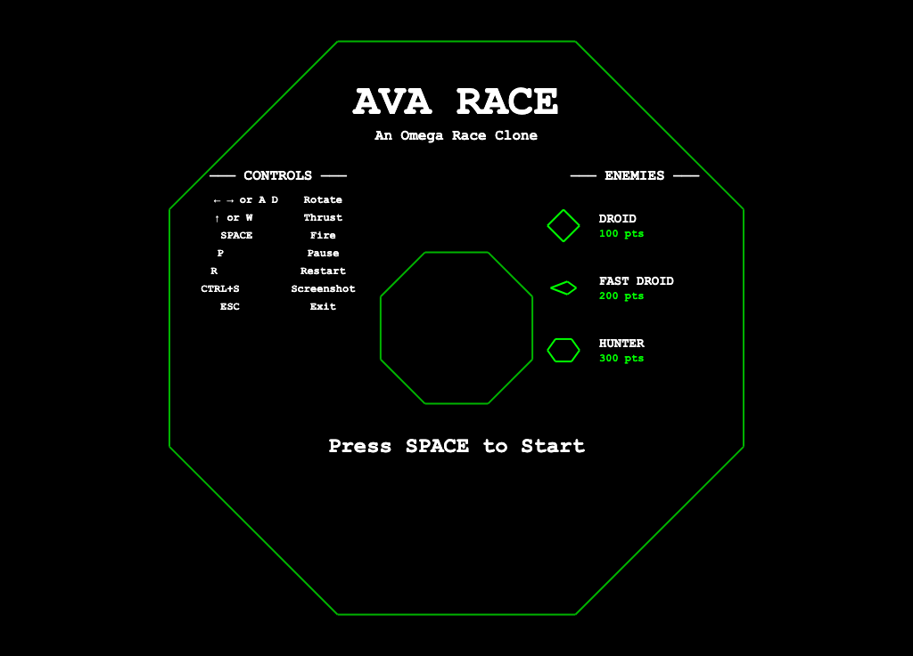
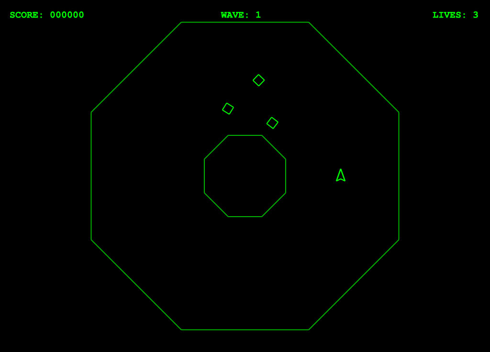
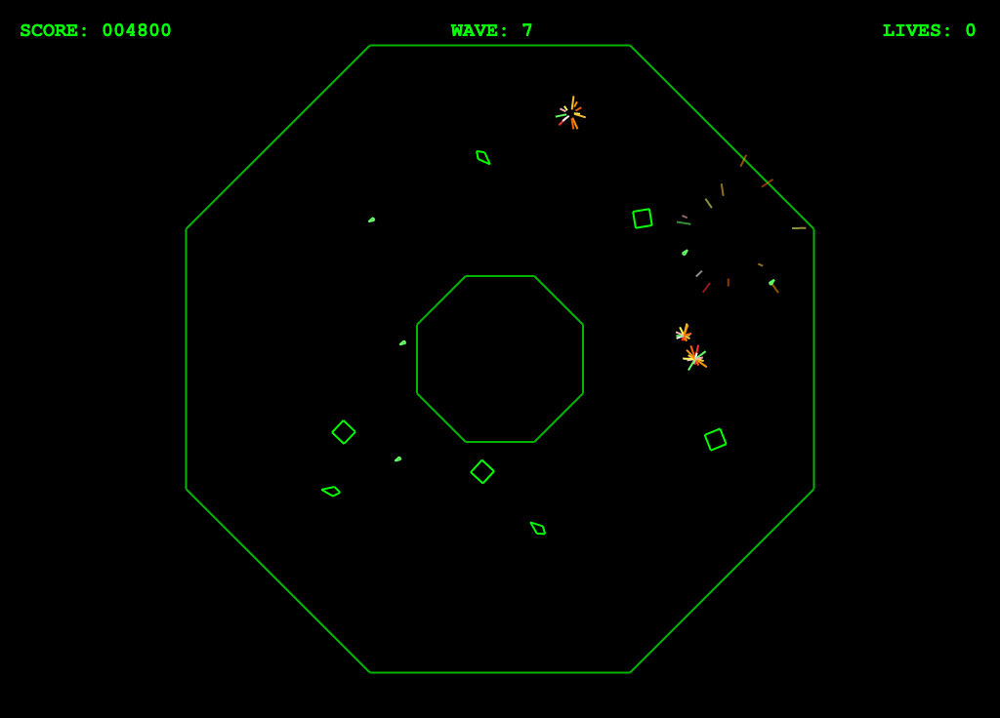

# AVARace

A clone of the classic 1981 arcade game **Omega Race** built with Avalonia UI and .NET 9, featuring authentic wireframe vector graphics rendering.

## About

Omega Race was a unique arcade game featuring vector graphics where players pilot a ship in an arena, destroying enemy droids while bouncing off walls. This clone recreates that experience with:

- Classic green-on-black wireframe vector graphics
- Authentic physics with wall bouncing
- Progressive difficulty with waves of enemies
- Retro synthesized sound effects
- Full MVVM architecture

## Screenshots







## Requirements

- .NET 9 SDK
- Compatible with Windows, macOS, and Linux

## Building and Running

```bash
# Build the project
dotnet build

# Run the game
dotnet run --project src/AVARace
```

## Controls

| Key | Action |
|-----|--------|
| **Left Arrow** / **A** | Rotate left |
| **Right Arrow** / **D** | Rotate right |
| **Up Arrow** / **W** | Thrust |
| **Space** | Fire |
| **P** | Pause |
| **R** | Restart (when game over) |
| **Ctrl+S** | Save screenshot |
| **Escape** | Exit |

## Gameplay

- Pilot your ship around the arena
- Destroy all enemy droids to advance to the next wave
- Avoid colliding with enemies
- Bounce off the outer walls and central obstacle
- Each wave brings more and faster enemies
- You have 3 lives - game over when all are lost

### Spawn Protection

- **Invulnerability**: When you spawn or respawn, your ship is invulnerable for 2 seconds (indicated by blinking)
- **Safe Spawning**: Enemies always spawn at a safe distance from the player, preventing unfair instant deaths

### Enemy Types

| Enemy | Points | Behavior |
|-------|--------|----------|
| **Droid** | 100 | Basic enemy, moves randomly |
| **Fast Droid** | 200 | Faster movement, appears from wave 2 |
| **Hunter** | 300 | Actively chases the player, appears from wave 3 |

## Sound Effects

The game features retro synthesized sound effects:

- **Shooting**: Descending pitch laser sound
- **Thruster**: Low rumble while thrusting
- **Explosion**: Deep bass rumble when enemies are destroyed

## Architecture

The project uses a full MVVM (Model-View-ViewModel) architecture with dependency injection:

- **Views**: Avalonia UI windows and custom canvas control
- **ViewModels**: Game state bindings and commands
- **Game Engine**: Core game loop, entity management, physics
- **Services**: DI-registered interfaces for testability
  - `IGameEngine` - Game logic and state management
  - `IInputHandler` - Keyboard input
  - `ISoundService` - Synthesized audio generation

## License

This project is licensed under the MIT License - see the [LICENSE](LICENSE) file for details.
